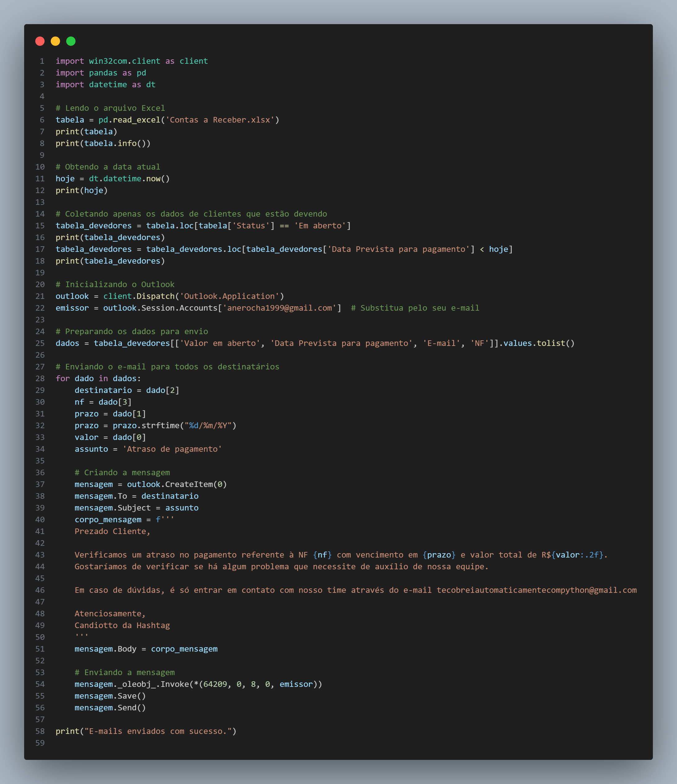

# Notificação de Pagamentos Atrasados

Este projeto foi desenvolvido com base em uma videoaula do canal **Hashtag** e tem como objetivo automatizar o processo de envio de e-mails para clientes com pagamentos atrasados. O script utiliza Python para ler dados de um arquivo Excel, identificar clientes que estão com pagamentos pendentes e enviar notificações via Outlook.





## Descrição do Projeto

O projeto consiste em um script Python que realiza as seguintes tarefas:

1. **Importação de Bibliotecas**:
   - Utiliza `win32com.client` para interagir com o Outlook.
   - Utiliza `pandas` para manipular dados.
   - Utiliza `datetime` para trabalhar com datas.

2. **Leitura do Arquivo Excel**:
   - O script lê um arquivo Excel chamado `Contas a Receber.xlsx` que contém informações sobre contas a receber.

3. **Filtragem de Dados**:
   - Coleta apenas os dados de clientes que estão com status de pagamento "Em aberto" e cuja data prevista para pagamento já passou.

4. **Envio de E-mails**:
   - Inicializa o Outlook e utiliza a conta de e-mail configurada para enviar notificações de atraso de pagamento.
   - Cria e envia e-mails para os clientes com as informações sobre o atraso.

## Observações

- **E-mail do Emissor**: Certifique-se de substituir `'anerocha1999@gmail.com'` pelo e-mail real que está configurado no Outlook.
- **Arquivo Excel**: O arquivo `Contas a Receber.xlsx` deve estar no mesmo diretório que o script ou o caminho deve ser ajustado conforme necessário.
- **Permissões e Configurações**: O Outlook deve estar instalado e configurado corretamente no seu sistema. As configurações de segurança do Outlook devem permitir automação via `win32com`.
- **Segurança**: Certifique-se de que o script não será utilizado para enviar e-mails não solicitados ou spam.

## Como Executar

1. Instale as bibliotecas necessárias:
   ```bash
   pip install pandas pywin32
